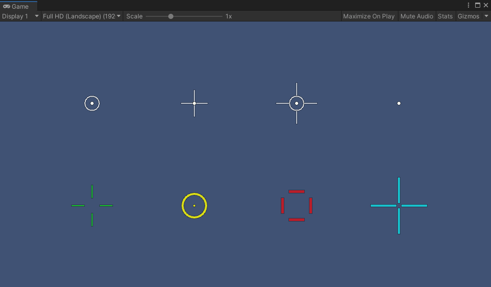

# Custom Reticle Project
Dynamic vector reticle for any project made with Unity.

## Unity version
[Unity 2019.4.8f1](https://unity3d.com/unity/whats-new/2019.4.8) or newer.

## Features
- Fully scalable, vector reticle.
- Render with a single draw call.
- Can be baked at runtime.
- Module design, easy to implement new shapes.
- Lightweight vertex color shader.

## Example
Drag and drop reticle prefab (Assets/Prefabs/Reticle) and assign new script with example code.
Make sure the camera's projection mode is set to Orthographic and its size is set to 240.
```csharp
using UnityEngine;
using CustomReticle;

public class Example : MonoBehaviour
{
    public Reticle reticle;

    void Start()
    {
        IMeshData meshData = reticle.GetNewMeshData();

        MeshBuilder.AppendSolidCircle(meshData, 8, 2, Color.red);
        MeshBuilder.AppendOutlinedCircle(meshData, 24, 16, 15, Color.red);

        reticle.ApplyMeshData();
    }
}
```

## License
[MIT License](https://choosealicense.com/licenses/mit/).

## Preview
